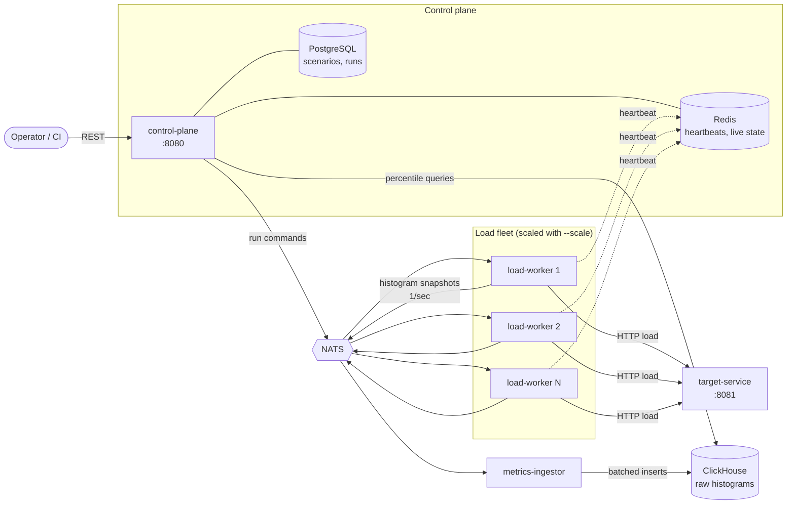

# PulseForge

A distributed, self-hosted load testing engine. You describe an HTTP load scenario; PulseForge
spreads it across N workers, generates open-loop load, streams the measurements back, and answers
with global p50/p95/p99 latency and throughput.

This is a reference implementation built to demonstrate distributed-systems design, not a
production product. The interesting parts are the measurement decisions, not the feature list —
see [Design Decisions](#design-decisions).

> **Status: Phase 3 of 4 complete — distributed and fault-aware.** Load is sharded across a scaled
> worker fleet, percentiles are merged globally, and a worker that dies mid-run turns the result
> DEGRADED instead of quietly shortening it. See [Roadmap](#roadmap).

---

## Quick start

Requires only Docker. No JDK or Gradle on the host — the build runs inside the image.

```bash
git clone https://github.com/henesos/pulseforge.git
cd pulseforge/docker
docker compose up -d --build
```

First build takes a few minutes (Gradle resolves dependencies once, then caches them). When it
settles, all eight containers report healthy:

```
$ docker compose ps --format "table {{.Service}}\t{{.Status}}"
SERVICE            STATUS
clickhouse         Up 9 minutes (healthy)
control-plane      Up 44 seconds (healthy)
load-worker        Up 9 minutes (healthy)
metrics-ingestor   Up 44 seconds (healthy)
nats               Up 9 minutes (healthy)
postgres           Up 15 minutes (healthy)
redis              Up 15 minutes (healthy)
target-service     Up 9 minutes (healthy)
```

Verify the deployment can actually run a test — one call, every dependency:

```bash
$ curl -s localhost:8080/api/v1/system/status | jq
{
  "status": "UP",
  "version": "0.2.0",
  "checkedAt": "2026-08-13T19:28:01.650743560Z",
  "components": {
    "clickhouse": "UP",
    "db": "UP",
    "diskSpace": "UP",
    "nats": "UP",
    "ping": "UP",
    "redis": "UP"
  }
}
```

The endpoint returns **503** if any dependency is down, so a CI smoke test can rely on the HTTP
status alone.

### Running a load test

```bash
# 1. Submit a scenario
curl -X POST localhost:8080/api/v1/scenarios \
     -H 'Content-Type: application/x-yaml' \
     --data-binary @examples/smoke-test.yaml
# -> {"id":"371484cb-...","name":"smoke-test","arrivalRate":200,"assertions":["p95 < 400ms",...]}

# 2. Start a run
curl -X POST 'localhost:8080/api/v1/runs?scenarioId=371484cb-...'
# -> {"id":"63c11c95-...","status":"RUNNING","expectedWorkers":1,...}

# 3. Read the results (202 while running, 200 once terminal)
curl -s localhost:8080/api/v1/runs/63c11c95-.../results | jq
```

Actual output from the smoke-test scenario (200 req/s for 20s with a 5s ramp, three weighted
steps):

```
step                      requests   errors    err%       p50       p95       p99       max
------------------------------------------------------------------------------------------
GET /api/fast                 2101        0   0.00%    1.88ms    3.16ms    3.42ms   10.01ms
GET /api/flaky                 359       29   8.08%   20.91ms   21.47ms   21.76ms   23.31ms
POST /api/slow                1040        0   0.00%  148.86ms  178.30ms  180.99ms  181.50ms
------------------------------------------------------------------------------------------
run total                     3500       29   0.83%    2.91ms  170.88ms  179.46ms  181.50ms

throughput 181.6 req/s   workers 2   dropped samples 0   skipped requests 0

ASSERTIONS                         actual   result
  p95 < 400ms                      170.88   PASS
  errorRate < 5%                     0.83   PASS

  PASS
```

The request count is not approximate: a 5s linear ramp to 200 req/s delivers exactly 500 requests
(the triangle under the ramp), plus 15s of steady state at 200 req/s — **3 500**, which is what
the run issued. And each worker put ~61 snapshot messages on the bus for its share of those 3 500
requests — three steps once a second for 20 seconds, plus a final flush — because workers ship one
histogram per step per interval rather than one message per request.

### Scaling the fleet

```bash
docker compose up -d --scale load-worker=5
curl -s localhost:8080/api/v1/system/status | jq .liveWorkers   # -> 5
```

Workers claim shards themselves with a single atomic Redis `INCR`; the Nth worker to see the
broadcast command takes shard N-1. No leader election, and no window in which two workers hold the
same shard and silently double the offered rate.

```
$ docker compose logs load-worker | grep 'claimed shard'
load-worker-6  Run fd4cee3b...: claimed shard 0 of 5, generating 40.0 req/s
load-worker-2  Run fd4cee3b...: claimed shard 1 of 5, generating 40.0 req/s
load-worker-3  Run fd4cee3b...: claimed shard 2 of 5, generating 40.0 req/s
load-worker-4  Run fd4cee3b...: claimed shard 3 of 5, generating 40.0 req/s
load-worker-5  Run fd4cee3b...: claimed shard 4 of 5, generating 40.0 req/s
```

The same scenario run on 1 worker and on 5 issues **3 500 requests either way** — the shards sum
back to the requested rate exactly, remainder included.

### When a worker dies

```bash
docker kill --signal=KILL pulseforge-load-worker-4      # mid-run, no chance to deregister
```

```
$ curl -s localhost:8080/api/v1/runs/b5a3c434-.../results | jq '.results | {status, statusReason, totalRequests}'
{
  "status": "DEGRADED",
  "statusReason": "1 of 3 worker shards stopped reporting (2 alive, 0 finished when detected); the run generated less than the requested 250 req/s",
  "totalRequests": 10815
}
```

The worker was killed 20 seconds in. The run kept going for its full 60 seconds on the two
surviving shards and turned terminal 78 seconds after it started — the duration, plus the settle
window. A complete run at 250 req/s would have issued ~14 375 requests; this one managed 10 815,
which is the two survivors' full share plus what the third managed before it died — and **its
assertions still pass**. That is precisely why `DEGRADED` is a
status rather than a footnote: the percentiles look perfectly healthy and describe an experiment
that never actually ran.

### The target under test

The project is self-contained: load is applied to a bundled service with tunable latency and
failure behaviour, never to a third-party host.

| Endpoint      | Behaviour                                | Default          |
|---------------|------------------------------------------|------------------|
| `/api/fast`   | near-instant, the measurement baseline   | 0 ms + 2 ms jitter   |
| `/api/slow`   | slow enough to make percentile tails visible | 120 ms + 60 ms jitter |
| `/api/flaky`  | fails a fixed share of requests with 503 | 20 ms, 10 % errors |

All three are configured under `pulseforge.target.*` in `target-service/src/main/resources/application.yml`.

```bash
$ for i in $(seq 40); do curl -s -o /dev/null -w "%{http_code}\n" localhost:8081/api/flaky; done | sort | uniq -c
     37 200
      3 503
```

---

## Architecture



The split is deliberate: **Postgres holds the small mutable state** (scenario definitions, run
status) where transactions and foreign keys matter, while **ClickHouse holds the large append-only
measurement stream** where columnar scans and merge-tree aggregation matter. Neither database is
asked to do the other's job.

### Modules

| Module             | Responsibility                                                            |
|--------------------|---------------------------------------------------------------------------|
| `common`           | Domain model, wire protocol, protobuf contract, shared NATS plumbing       |
| `cli`              | CI entry point: runs a scenario and exits with the verdict                 |
| `control-plane`    | Public REST API; scenario CRUD, run lifecycle, result queries              |
| `load-worker`      | Consumes run commands, generates HTTP load, aggregates and ships histograms |
| `metrics-ingestor` | Consumes snapshots, batches them, writes to ClickHouse                     |
| `target-service`   | The bundled system under test                                              |

`common` is split on purpose: `io.pulseforge.common.domain` is plain Java with no framework
annotations and is unit-testable without a container, while `io.pulseforge.common.nats` is
explicitly Spring-aware infrastructure that services opt into with `@Import`.

---

## Scenario format

```yaml
name: checkout-flow-baseline
target: http://target-service:8081
duration: 120s
rampUp: 30s
arrivalRate: 400          # requests per second — an arrival rate, not a virtual-user count
steps:
  - method: GET
    path: /api/fast
    weight: 70
  - method: POST
    path: /api/slow
    weight: 30
    body: '{"item":"sku-1"}'
assertions:
  - p95 < 250ms
  - errorRate < 1%
```

Weights are relative, not percentages, so adding a step does not require rebalancing the others.
Assertions are evaluated when the run ends and decide its PASS/FAIL verdict — reflected in the
process exit code so the tool drops into a CI pipeline without a wrapper script.

### CI usage

The CLI turns a run into an exit code, which is the only thing a pipeline needs from a load tester:

```bash
pulseforge run examples/checkout-flow-baseline.yaml --control-plane http://pulseforge:8080
```

| Exit | Meaning |
|------|---------|
| `0` | every assertion passed on a complete measurement |
| `1` | an assertion failed — the regression signal |
| `2` | the run was degraded: a worker was lost, or samples were dropped |
| `3` | usage error, unreachable control plane, or invalid scenario |

`2` is deliberately distinct from `1`, and this is the case that shows why. A worker was SIGKILLed
mid-run:

```
run DEGRADED

step                      requests   errors    err%       p50       p95       p99       max
------------------------------------------------------------------------------------------
GET /api/fast                10815        0   0.00%    1.95ms    3.26ms    3.56ms   30.18ms
------------------------------------------------------------------------------------------
run total                    10815        0   0.00%    1.95ms    3.26ms    3.56ms   30.18ms

throughput 188.8 req/s   workers 3   dropped samples 0   skipped requests 0

!! run status DEGRADED
   1 of 3 worker shards stopped reporting (2 alive, 0 finished when detected); the run
   generated less than the requested 250 req/s

ASSERTIONS                         actual   result
  p95 < 500ms                        3.26   PASS
  errorRate < 5%                     0.00   PASS

  PASS
$ echo $?
2
```

**The assertions passed and the command still failed.** A degraded run outranks its own verdict:
the percentiles are perfectly healthy and describe an experiment that never fully ran. The two exit
codes call for different reactions — `1` is a code regression to investigate, `2` is infrastructure
to fix and a reason to re-run.

### Choosing a metric transport

```bash
METRICS_TRANSPORT=grpc docker compose up -d --scale load-worker=3
```

```
load-worker-2  GrpcSnapshotTransport   : gRPC snapshot transport targeting metrics-ingestor:9090
load-worker-2  TransportConfiguration  : Shipping snapshots over grpc
metrics-ingestor  GrpcIngestionServer   : gRPC ingestion listening on port 9090
```

The same scenario over gRPC produced the same 3 501 requests and the same percentiles as over NATS,
with `sum(count)` in `latency_buckets` matching `sum(request_count)` exactly — no duplication, no
loss. Both paths feed the same bounded buffer and the same batching writer in the ingestor, so
switching transport cannot quietly change how data is persisted, only how it travels.

|  | NATS (default) | gRPC |
|---|---|---|
| Coupling | workers need no ingestor address | workers must resolve the ingestor |
| Hops | worker → broker → ingestor | worker → ingestor |
| Delivery feedback | none | per-stream accepted/rejected counts |
| Contract | JSON, checked at runtime | protobuf, checked at compile time |
| Scaling ingestors | add a subscriber | needs load balancing |
| Failure mode | broker down stops all metrics | one ingestor down stops one worker's metrics |

The ingestor listens on both at once by default, which is what makes migrating a fleet possible one
worker at a time rather than in a flag day.

---

## Design Decisions

### 1. Workers aggregate locally; they never ship one message per request

**Problem.** At 10 000 requests/second across 5 workers, emitting one metric message per request
means 10 000 messages/second through NATS and 10 000 rows/second into ClickHouse. The measurement
layer collapses before the target does, and you end up load-testing your own telemetry.

**Options.** (a) One message per request, aggregate centrally — simple, correct, and fatally
slow. (b) Sampling — cheap, but throws away exactly the tail that percentile assertions exist to
measure. (c) Local aggregation into an HdrHistogram, ship a serialized snapshot on an interval.

**Choice.** (c). Each worker records latencies into an HdrHistogram in-process and publishes one
snapshot per second per step. Message volume becomes `workers × steps` per second — independent of
request rate.

**Trade-off.** Results are visible at snapshot granularity rather than instantly, and a worker that
dies mid-interval loses up to one second of its samples. Both are acceptable; a telemetry pipeline
that distorts the measurement is not. This is the single most important decision in the project.

### 2. Percentiles are merged from histograms, never averaged

**Problem.** With load split across 5 workers, each reports its own p99. It is tempting to average
them. **The mean of five p99 values is not the p99 of the combined population** — it is a number
with no statistical meaning, and it is systematically wrong whenever load is unevenly distributed.

**Options.** (a) Average the per-worker percentiles — wrong. (b) Ship every raw sample and compute
exactly — correct, but that is decision 1 all over again. (c) Merge the distributions, then compute
the percentile once over the merged population.

**Choice.** (c). Histograms are stored decomposed into `(bucket, count)` rows in the
`latency_buckets` table; a global percentile is the cumulative sum over buckets summed across all
workers. ClickHouse does the merge; the arithmetic happens once, over the whole population.

**Trade-off.** Precision is bounded by HdrHistogram's bucket resolution (configured to three
significant digits) rather than exact. That is a known, quantified error — unlike averaging, which
is unbounded and unquantifiable.

`HistogramMergeTest` pins this down with two workers — one handling 10 000 fast requests, one
handling 100 slow ones. Averaging their p99s reports **~100 ms**; the population's actual p99 is
**~5 ms**, because those 100 slow samples sit entirely above the 99th percentile. A 20× error, in
whichever direction the traffic split happens to push it.

### 3. Backpressure drops samples; it never slows the generator

**Problem.** If the metric pipeline stalls, something has to give. Blocking the load generator
until the queue drains is the intuitive answer and the wrong one: the generator stops issuing
requests, the offered rate silently drops, and the entire run's numbers become fiction.

**Options.** (a) Block the generator — destroys the experiment. (b) Unbounded queue — moves the
failure to an OOM under exactly the conditions you were testing. (c) Bounded queue, drop on
overflow, count every drop.

**Choice.** (c). The outbound metric queue is bounded (`pulseforge.worker.metric-queue-capacity`).
On overflow the sample is discarded and `dropped_samples` is incremented, stored per snapshot in
ClickHouse and **surfaced in the run report**.

**Trade-off.** Results can be incomplete. That is the point: a run that reports
`dropped_samples: 12043` tells you its percentiles are suspect, whereas silent data loss produces
a clean-looking report that is quietly wrong.

### 4. Open-loop arrival rate, because coordinated omission destroys tail latency

**Problem.** The standard load generator keeps N virtual users in a request → wait → request loop.
When the target slows down, those users issue *fewer* requests — so the slow period is
under-sampled precisely when it matters. This is **coordinated omission**: the measurement
apparatus cooperates with the system under test to hide its worst behaviour. A target that stalls
for 10 seconds shows up as a handful of slow samples instead of thousands, and p99 comes out
looking healthy.

**Options.** (a) Closed-loop virtual users — simple, and systematically flattering. (b) Closed-loop
with post-hoc correction — better, but corrects a distortion instead of avoiding it.
(c) Open-loop: requests are scheduled at a fixed arrival rate, independent of response times.

**Choice.** (c). `arrivalRate` is a schedule, not a concurrency level. If the target slows, requests
keep being issued on time and latency is measured against the *intended* send time, so queueing
delay lands in the histogram where it belongs.

**Trade-off.** An open-loop generator against a collapsing target accumulates in-flight requests,
which is why `max-concurrent-requests` exists as a memory guard. It also does not model a real user
who would give up and go away — but modelling that is the job of the scenario, not the generator.

### 5. Worker failure produces DEGRADED, never a quietly incomplete result

**Problem.** With five workers each issuing a fifth of the load, one dying mid-run means the
achieved rate silently drops to 80 %. The run still finishes and still produces plausible
percentiles — from an experiment that never actually ran.

**Options.** (a) Ignore it. (b) Abort the whole run. (c) Detect it, finish the run, and mark the
result.

**Choice.** (c). Liveness is a Redis key with a TTL that gets refreshed, not a registration that
gets deleted on shutdown — a worker that is SIGKILLed, partitioned or wedged in a GC pause never
gets to deregister itself, and those are exactly the failures worth catching. Expiry *is* the
signal. The check is `claimed shards == still alive + already finished`; anything missing from both
sides stopped without saying so. Detection and termination are deliberately separate: the loss is
recorded the moment it is seen, but the run keeps going and the survivors generate load for the
full duration that was asked for. Only once that duration is spent — plus the settle delay — does
the status turn `DEGRADED`, carrying a reason that names the shortfall. Ending the run at detection
time would flip `/results` to a final `200 OK` while load was still being issued, so the same URL
would keep answering with larger numbers afterwards.

Two levels of liveness exist because they answer different questions: fleet presence
(`pulseforge:workers:*`) says which workers are available to receive a run, per-run liveness
(`pulseforge:run:<id>:alive:*`) says which are actually generating load right now. A process can be
healthy while its generator thread is dead.

**Trade-off.** Requires liveness tracking and a watchdog the system would otherwise not need, and
the TTL sets a floor on detection latency: a 2s heartbeat with a 3x TTL expires after 6s, and the
watchdog polls every 5s, so a death is noticed 6-11s after it happens. Tolerating two missed
heartbeats is what keeps a GC pause from being mistaken for a death. Worth it: the alternative is a
report that looks correct and isn't.

### 6. Ramp-up is part of the load profile, not a client-side courtesy

**Problem.** Slamming a cold target with 500 RPS on the first tick measures JIT warm-up, cold
connection pools and empty caches — not steady-state behaviour.

**Options.** (a) Warm up manually before the run. (b) Discard the first N seconds of results.
(c) Model ramp-up in the profile itself.

**Choice.** (c). `rampUp` makes the target rate rise linearly from zero. `ArrivalSchedule` inverts
the integral of that rising rate to get each request's send time, and every worker applies the same
shape to its own shard, so the fleet-wide rate follows the intended curve.

**Trade-off.** The ramp window mixes warm-up with steady-state samples in the overall histogram.
Per-window snapshots keep both separable in analysis.

---

## Known Limitations

Deliberately out of scope for a portfolio reference implementation:

- **No authentication or authorization.** The REST API is fully open. Any real deployment needs at
  minimum an API key in front of the run-trigger endpoints — this thing generates traffic.
- **No TLS anywhere.** Plain HTTP between services and to the target; NATS is unauthenticated.
- **HTTP/1.1 only.** No gRPC, WebSocket or raw-TCP load. The step model assumes request/response.
- **Single region, single compose network.** No cross-region worker placement, so this measures
  application latency, not network geography.
- **No stateful scenarios.** No cookie jars, no correlation of a response value into the next
  request, no login flows. Steps are independent and weighted.
- **In-memory run state.** Redis persistence is off; a Redis restart mid-run loses liveness data.
- **No result retention policy beyond a 30-day TTL** on the ClickHouse tables.
- **Percentile precision is bounded** by histogram bucket resolution (see decision 2).
- **Reported throughput averages over the whole run, ramp-up included.** A 20s run with a 5s ramp
  to 200 req/s reports ~166 req/s, not 200 — the ramp genuinely delivered less. Correct, but worth
  knowing before writing a `throughput >` assertion.
- **Assertions cover p50, p95 and p99 only.** A `p99.9` assertion is rejected at evaluation time
  rather than silently answered with p99.
- **Per-worker latency is not queryable.** `latency_buckets` carries no `worker_id` column — the
  table exists to be merged across workers, and adding the dimension would invite exactly the
  averaging mistake decision 2 is about. The cost is real: "which worker saw the slow tail?" cannot
  be answered from the bucket table, only from the raw histogram blobs in `metric_snapshots`.
- **Fleet size is frozen at dispatch.** Workers that start mid-run sit the run out rather than
  joining, since a rate that changes halfway through would splice two experiments together.
- **Shard rounding shifts the total by a request or two.** 200 req/s across 3 workers gives shards
  of 67/67/66 — exact — but each shard rounds its own ramp-up integral independently, so a run may
  issue 3 501 rather than 3 500. Visible, bounded, and not worth a distributed counter to remove.
- **gRPC ingestion is single-endpoint.** Workers dial one ingestor address with no client-side load
  balancing, so scaling ingestors horizontally needs a proxy in front. The NATS path scales by
  simply adding a subscriber.

---

## Roadmap

| Phase | Scope | Status |
|-------|-------|--------|
| 1 | Gradle multi-module skeleton, compose stack, target service, control-plane status API | ✅ Done |
| 2 | End to end: YAML parsing, NATS dispatch, open-loop generation, HdrHistogram aggregation, ClickHouse ingestion, merged percentiles, assertion verdict | ✅ Done |
| 3 | Distributed scaling: atomic shard claiming, two-level Redis liveness, DEGRADED detection | ✅ Done |
| 4 | gRPC ingestion path, CLI with CI exit codes, Testcontainers integration tests | ✅ Done |

Ramp-up and the assertion engine were originally scheduled for Phase 4 but landed in Phase 2 —
the arrival-schedule maths needed the ramp anyway, and results without a verdict are only half a
feature.

---

## Development

The Gradle build runs inside a container, so the host needs nothing but Docker. The cache volume
has to be created with your own ownership first — Docker would otherwise create it root-owned, and
Gradle running as `$(id -u)` cannot unpack its native libraries into it:

```bash
# Once per machine.
docker volume create pulseforge-gradle
docker run --rm -v pulseforge-gradle:/gradle-home alpine \
  chown -R $(id -u):$(id -g) /gradle-home

# Every build after that.
docker run --rm -u $(id -u):$(id -g) \
  -v "$PWD":/workspace -v pulseforge-gradle:/gradle-home \
  -w /workspace -e GRADLE_USER_HOME=/gradle-home \
  gradle:8.11-jdk21 gradle build
```

Skipping the `chown` fails with `Failed to load native library 'libnative-platform.so'`, which does
not mention permissions anywhere.

`./gradlew build` works too, but only with a **JDK 21** on the host. The toolchain is pinned to 21
and no download repository is configured, so an older JDK fails with `No locally installed
toolchains match` rather than fetching one.

The unit tests cover the parts where a subtle error would silently corrupt results: the arrival
schedule's ramp-up integral, scenario and assertion parsing, the histogram merge, rate sharding,
the assertion-to-measurement mapping behind the verdict, and completion accounting.

```bash
./gradlew test               # 41 unit tests, no Docker required
./gradlew integrationTest    # Testcontainers: real ClickHouse and PostgreSQL
```

Integration tests are a separate task on purpose — `gradle build` must stay runnable anywhere, and
a fast unit-test loop is worth more than the convenience of one command.

> **Note:** `integrationTest` needs a Docker daemon whose published ports are reachable from the
> JVM running the tests. It works from a host JDK. It does **not** work when Gradle itself runs
> inside a container on Docker Desktop for WSL: Testcontainers publishes ports to the Docker VM's
> host, which a sibling container cannot reach at either `172.17.0.1` or `host.docker.internal`.
> The tests in this repository were compiled and wired up but have not been executed in that
> containerised setup.

### Tech stack

Java 21 · Spring Boot 3.3 · Gradle (Kotlin DSL) · PostgreSQL · ClickHouse · Redis · NATS ·
HdrHistogram · Docker Compose · JUnit 5 + Testcontainers
